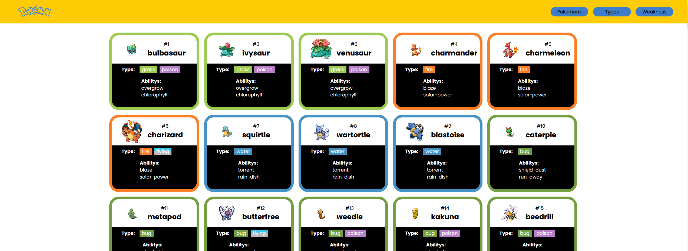

<h1>POKEDEX</h1>
<h3>
A pokedex made with the api from https://pokeapi.co/.
</h3>

This has been a very fun challenge, especially with Typescript, which has been giving me a few errors here and there. I hope whenever possible when I'm learning I can implement something here. Enjoy

  

