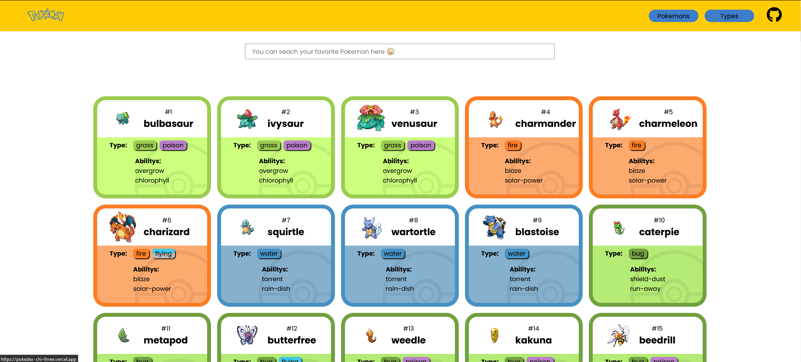
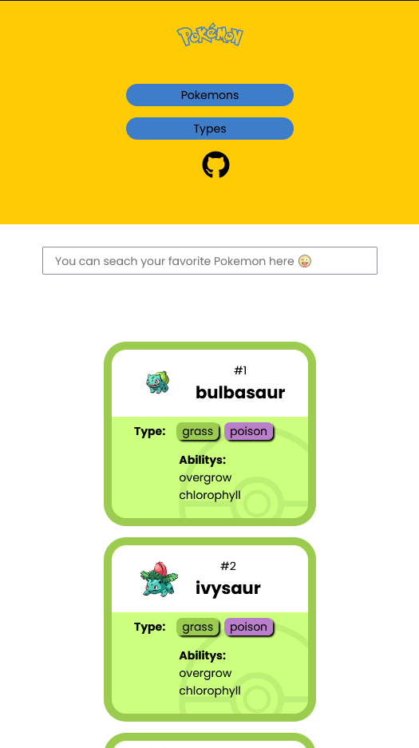

<h1 align="center">POKEDEX</h1>
<p align="center">
A pokedex made with the api from https://pokeapi.co/.
</p>
<div align="center">
  
  
</div>

### Deploy

You can acess [here](pokedex-chi-three.vercel.app/)

### 🚧 Features

This project is not finished yet 
<br>
Check the futures implementations below:
 
 - [ ] Pagination
 - [ ] Pokemon generation change
 - [ ] Game Who's that pokemon
 - [ ] Button Designs
 - [ ] Performance increase

### 📦 Install
After you clone this project yout can:
<h3>NPM </h3>

```bash
npm install
npm start
```

<h3>Yarn</h3>

```bash
yarn add
yarn start
```

### 🛠 Technologies
 
 - [Node.js](https://nodejs.org/en/)
 - [React](https://pt-br.reactjs.org/)
- [TypeScript](https://www.typescriptlang.org/)
- [SASS](https://sass-lang.com/)

### 👨🏾‍💻 Author
<a href="https://github.com/HuberthVladimir">
 
 <br />
 <sub style="margin-bottom: 3px;"><b>Huberth Vladimir</b></sub></a>
 
 [](https://www.linkedin.com/in/huberth-vladimir/) 
